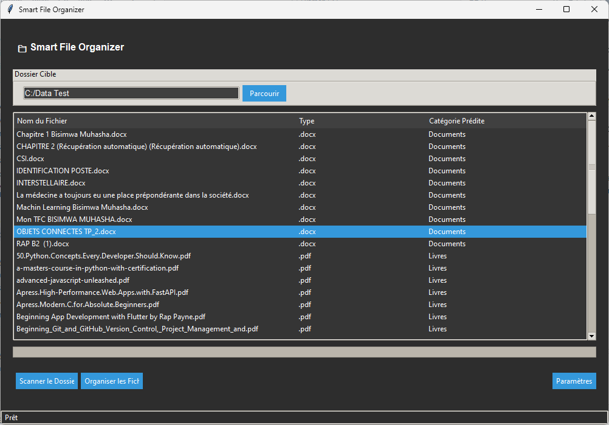

# 🗂 Smart File Organizer - Intelligent File Classifier



**An open source system for automatic file organization using artificial intelligence** 
*(Currently in minimal viable product stage)*

[](https://opensource.org/licenses/MIT)
[](https://www.python.org/)
[](CONTRIBUTING.md)

## 🌟 Current Features

### 🧠 File Classification
- Currently supports 4 file types:
  - Documents (.docx)
  - Books (.pdf)
  - Videos (common video formats)
  - Photos (common image formats)
- Basic ML model for file type detection
- Room for improvement and extension to more file types

### 🖥 Interface
- Built with Python Tkinter
- Simple and functional GUI
- Real-time progress bar
- Basic statistics visualization

### ⚙️ Advanced Features
- Real-time monitoring (watchdog)

## 🔄 Future Improvements
- Support for more file types
- Advanced ML model training
- Enhanced file type detection
- Modern GUI framework implementation
- Additional classification criteria

## 📦 Installation

### Prerequisites
- Python 3.8 or higher
- Pipenv (recommended)

### Installation Method
```bash
git clone https://github.com/your-repo/smart_file_organizer.git
cd smart_file_organizer
python -m venv .env
pip install -r requirements.txt
```

## 🚀 Quick Start

1. Activate the virtual environment:
```bash
source .env/bin/activate  # Linux/Mac
.env\Scripts\activate     # Windows
```

2. Launch the application:
```bash
python main.py
```

## 📁 Project Structure
```
smart_file_organizer/
├── core/               # Core business logic
│   ├── classifier.py   # File classification
│   ├── organizer.py   # File organization
│   ├── scanner.py     # Folder scanning
│   └── watcher.py     # Real-time monitoring
├── gui/               # Graphical interface
│   ├── main_windows.py
│   └── widgets.py
├── models/            # Trained ML models
└── tests/            # Unit tests
```
## Train your model


## 🛠 Configuration and Usage

1. Launch the graphical interface
2. Select a folder to organize via "Browse"
3. Click "Start Scan" to analyze
4. Use "Organize Files" to automatically classify

## 🤝 Contributing

Areas where contributions would be particularly valuable:
- Extending file type support
- Improving ML classification accuracy
- Enhanced GUI development
- Additional classification features

Check our contribution guide for more details.

## 📝 License

This project is under MIT license. See the [LICENSE](LICENSE) file for more details.